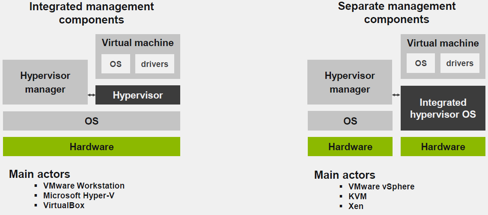
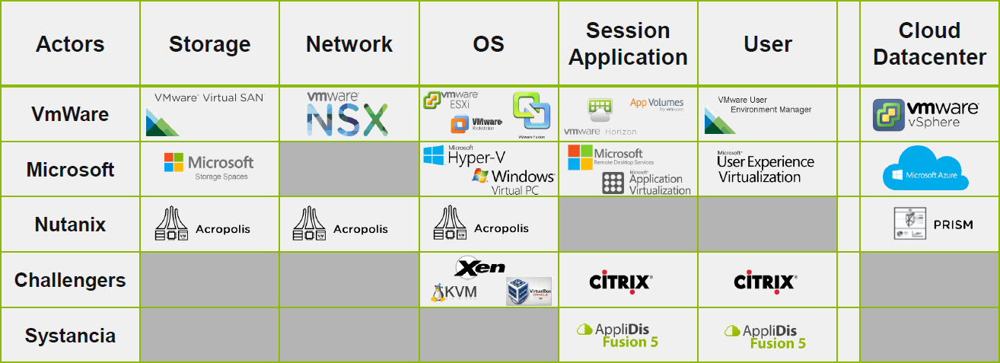

# 4SYS - Application & User Virtualization

## Introduction

### Les fondations de la virtualisations

Les objectifs de la virtualisations sont :

- L'optimisation et la mutualisation des ressources
- Réduction des couts
- L'automatisation
- Améliorer la disponibilité et la scalabilité
- Consolidation (regroupement cohérent de données) 

Les différents niveaux de virtualisation sont :

- Stockage
- Réseau
- OS
- Session / Application
- Environnement d'exécution
- Utilisateur

Virtualisation du stockage :

- Indépendant du matériel
- Flexiblilité
- Optimisation de l'espace

Technologies :

- Pools de stockage
- vNAS
- Solutions de stockage logicielles

Virtualisation du réseau :

- Flexibilité
- Contrôle / Sécurité
- Isolation
- Performance

Technologies de virtualisation du réseau

- vLAN
- vSwitch

Virtualisation de l'OS :

- Disponibilité
- Scalabilité
- Performance

Technologies de virtualisation de l'OS :

- Hyperviseurs

Virtualisation de session :

- Mutualisation des ressources
- Compatibilité

Technologies de virtualisation de session :

- VDI (Virtual Desktop Infrastructure)
- SBC (Server-Based-Computing ou publication d’applications).

Virtualisation des applications :

- Streaming
- Isolation des ressources
- Compatibilité

Technologies de virtualisations des applications :

- App-V / ThinApp (VMware)

Virtualisation d'environnement exécution :

- Isolation des applications
- Sécurité
- Mobilité
- Meilleure gestion & MAJ

Technologies de virtualisation d'environnement exécution :

- Conteneur

Virtualisation des utilisateurs :

- Indépendance vis-à-vis de l'OS
- Performance
- Personnalisation / Configuration

Technologies de virtualisation des utilisateurs :

- Virtualisation du profil
- Redirection de fichiers
- Logiciel tiers
- Profil itinérant

Acteurs de la virtualisation :

Prérequis à la virtualisation :

- Compatibilité du matériel (CPU)
- Au moins 2Go RAM (pour Windows Server)
- 40Go HDD (pour Windows Server)

Protocoles d'accès :

- X Window
- ICA (Indenpendent Computing Architechure)
- PcoIP (PC-over-IP)
- RDP (Remote Desktop Protocol)

RDP travaille sur 4 couches du model OSI :

- Application
- Présentation
- Session
- Transport

3 Types de virtualisations couvert dans le cours :

- Application virtualization : accès aux applications sans rupture
- Standard Desktop Virtualization : démarre des bureaux complets basé sur un OS Serveur
- Extended Desktop Virtualization : démarre des bureaux complets basé sur un OS Workstation

Application virtualization :

- Installation de serveurs physiques ou virtuels avec des applications virtualisés
- Installation de serveurs physiques ou virtuels délivrant des solutions de virtualisation.
- Les utilisateurs démarrent des applications virtualisés hébergés sur des Serveurs de bureaux distants.
- Les applications sont affichées "sans rupture / de manière fluide" sur le PC de l'utilisateur.
- Utilisation ou non de n'importe quelle solution d'hypervision

Standard Desktop Virtualization :

- Doit utiliser une solution d'hypervision

- Installation de serveurs physiques ou virtuels avec des applications virtualisés
- Installation de serveurs physiques ou virtuels délivrant des solutions de virtualisation.
- Les utilisateurs démarrent une bureau complet hébergés sur des Serveurs de bureaux distants.
- Les applications sont démarrées à l'intérieur d'un bureau distant ou local.

Extended Desktop Virtualization :

- Doit utiliser une solution d'hypervision

- Installation de serveurs physiques ou virtuels avec des applications virtualisés... Puis installer des modèles de Workstation bureau virtualisé
- Installation de serveurs physiques ou virtuels délivrant des solutions de virtualisation.
- Les utilisateurs démarrent une bureau complet sur une workstation virtuelle clonée en utilisant  des services de bureaux distants.
- Les applications sont démarrées à l'intérieur d'un bureau distant ou local.

Architecture basée sur les rôles

- Broker / équilibreur
  - Rôle : c’est le composant le plus important. C’est l’intelligence du système. Ce rôle doit garantir à un utilisateur la disponibilité et la redirection vers un serveur disponible ou un poste de travail virtualisé.
  - Hébergement : définir ce rôle est la tâche la plus importante de l'architecte réseau. Les performances de la solution de virtualisation dépend principalement de ce rôle et sa disponibilité est critique !
  - Redondance : les éditeurs disposent généralement de leur propre mécanisme de redondance pour permettre une haute disponibilité de ce rôle.
- Console d'administration
  - Rôle: donner aux administrateurs un accès aux options de configuration, aux outils de reporting et de diagnostic.
  - Hébergement: la configuration standard consiste à installer la console d'administration avec 
  - Redondance: ce rôle n'est pas critique, si la console d'administration n'est pas disponible, aucune modification de la configuration peut être effectué, mais les utilisateurs peuvent accéder à la plate-forme de virtualisation

- Portail utilisateur / accès
  - Rôle: donner aux utilisateurs un point d'accès principal à la plate-forme de virtualisation. Pourrait être un portail web ou un web service hébergé pour fournir des configurations et des applications aux clients déployés sur les ordinateurs des utilisateurs
  - Hébergement: ce rôle est aussi critique que le rôle de broker / équilibreur! Vous pouvez le partager avec le rôle de broker / équilibreur
  - Redondance: utilisez le même mécanisme de redondance pour offrir aux utilisateurs une solution de haute disponibilité

- Applications
  - Rôle: fournir aux utilisateurs des applications virtualisées et VDI standard (ordinateurs de bureau SBC)
  - Hébergement: ce rôle doit être installé sur un serveur dédié dans un environnement de production. En préproduction ou en labo, Ce rôle peut être hébergé avec n'importe quel autre rôle en utilisant la meilleure pratique consistant à toujours installer Remote Desktop Services avant toute autre configuration.
  - Redondance: si aucun serveur n’est disponible, les utilisateurs ne peuvent démarrer aucune application virtualisée ni aucun poste de travail! Ce rôle est critique et vous devrez déployer suffisamment de serveurs pour permettre les tâches de maintenance ou la perte potentielle d’un serveur.

- DataBase / DataStore
  - Rôle: contenir toute la configuration de la solution de virtualisation et l’activité de l’utilisateur afin de fournir des statistiques et des fonctionnalité de prédictivité
  - Hébergement: définissez le rôle de la base de données d'hébergement du serveur. Ce peut être un membre de la solution de virtualisation ou dédié serveur pour de meilleures performances
  - Redondance: mécanisme interne, mise en cluster du mécanisme de redondance de la base de données)

- Annuaire
  - Rôle: authentifier les utilisateurs et, en fonction de l'appartenance à un groupe, autoriser l'accès aux applications virtualisées et ordinateurs de bureau
  - Hébergement: ce rôle devrait être dédié
  - Redondance: la redondance des annuaires fait partie d’un projet d’architecture de plus haut niveau (Business Continuity Plan / plan de reprise après sinistre)

- Passerelle
  - Rôle: donner aux utilisateurs une méthode de connexion alternative ou étendue: externe, proxy,…
  - Hébergement: selon le type de passerelle, peut être mutualisé lorsque des passerelles sont installées sur un réseau local (accès proxy) ou dédié si installé sur le réseau DMZ (accès externe
  - Redondance: ce rôle peut être critique en fonction d'une autre méthode de connexion et de son utilisation
- Hyperviseur
  - Rôle: nécessaire pour permettre le provisioning dynamique de serveur ou le VDI étendu (ordinateur virtuel dédié)
  - Hébergement: ce rôle devrait être dédié
  - Redondance: la redondance des hyperviseurs fait partie d’un projet d’architecture de plus haut niveau (Business Plan de continuité / plan de reprise après sinistre)