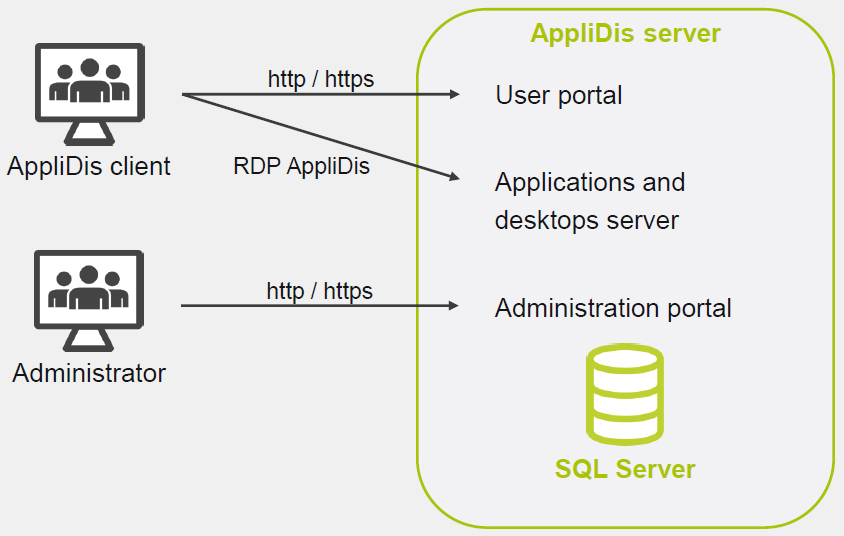

# 4SYS - Application & User Virtualization

## Virtualisation avec AppliDis

Architecture de départ :

- AD
  - Avec role DNS
- Réseau
  - Serveur DHCP pour les fonctionnalités d'AppliDis Provisioning et de virtualisation de bureau
  - Adresse IP fixe pour les autres machines
- Hôtes physiques
  - Soit des machines physiques ou un hyperviseur supportant les OS Windows.

Architecture typique pour AppliDis

- 2 BDD
- 2 serveurs d'applications et de bureau
- 2 serveurs centraux
  - Portails d'administration et utilisateur
  - Communication entre les différents composants d'AppliDis

Ajout d'un serveur peut être fait en quelques étapes :

- Dans la vue d'ensemble de l'infrastructure > Applications > Ajout de serveurs
- Cliquer sur le bouton de recherche
- Sélectionner les serveurs à ajouter
- Cliquer sur "Start" pour déployer le role

Pour publier une application, trois étapes :

- Ajouter les groupes AD à AppliDis
  - Depuis l'écran utilisateur, cliquer sur "add users group"
  - Sélectionner les groupes puis les ajouter
- Publier les applications dans AppliDis
  - Depuis la fenêtre application, ajouter une application
  - Entrer les informations requises pour chaque étape et terminer la publication
  - On peut ajouter une localisation au serveur et modifier des options avancées après la création
- Créer un contrat pour l'application
  - Depuis la fenêtre Contrat, ajouter un contrat
  - Remplier le formulaire de contrat en ajustant les réglages et valider

