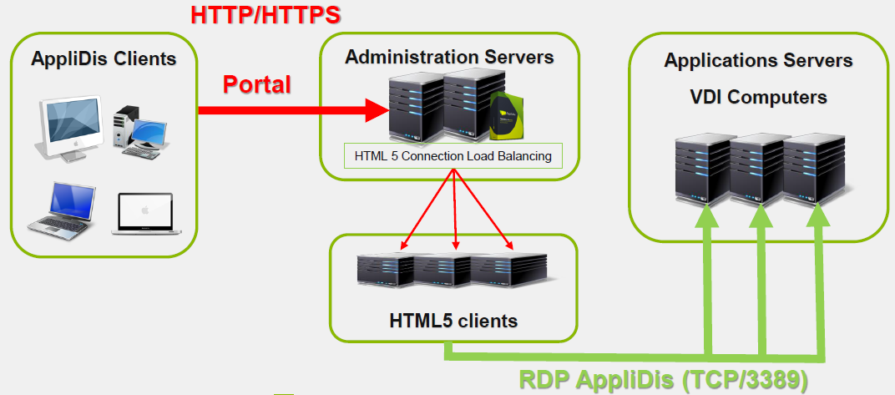

# 4SYS - Application & User Virtualization

## Virtualisation des applications et des utilisateurs

### Depuis Windows

- AppliDis Desktop
  - Les applications et les icones de bureaux sont affichées dans le menu de démarrage ou dans le bureau de l'utilisateur
  - Les groupes d'applications peuvent être affichées comme des dossiers contenant des icones d'applications
  - Packagé dans un ficher msi
  - Peut être déployé au travers d'une GPO (Stratégies de groupe)
- AppliDis Launcher
  - Démarrage des applications et des bureaux avec une ligne de commande
  - Personnaliser les méthodes d'ouverture en appelant un script ou un executable
  - Déployé avec le client MSI par défaut
  - Installé en copiant les fichier sur le poste client
- AppliDis SLB for Windows
  - Protocole RDP renforcé/amélioré avec support du load balancing
  - Bureau AppliDis seulement

### Depuis Linux

AppliDis SLB pour Linux

- Protocole RDP renforcé/amélioré avec support du load balancing comme le plugin Windows
- Supporte beaucoup de distributions Linux
- Basé sur les clients Rdesktop ou FreeRDP
- Peut être entièrement automatisé via fichier de configuration config.xml
- Utilisé seulement pour AppliDis Virtual desktop

### Depuis les clients légers

- Certains constructeurs incluent par défaut le client AppliDis SLB avec leurs clients légers Linux

- Les réglages sont effectués directement dans les menus du client en fonction du constructeur, les options du connecteur SLB étant identiques au plugin SLB standard

- Les clients légers Windows peuvent fonctionner avec les clients SLB ou Windows AppliDis en tant que solution standard

Clients légers spécifiques basés sur Dell Wyse ThinOS

- La technologie Dell Wyse thinOS peut être gérée directement dans la console d’administration AppliDis

- Dans la console d’administration AppliDis, à partir du menu Thin Client de la vue de la configuration, vous pouvez :
  - Créez des règles de clients légers qui définissent les paramètres de votre connexion et de votre client:
    - Type de règle, groupes d'utilisateurs,
    - Paramètres utilisés par le client via le modèle d'option créé (Drive, USB, Sound,…)
    - Définir le bureau ou l'application lancé

### Depuis les autres plateformes : accès alternatifs basé sur HTML5

Support

- Cross platform / OS
- Les postes clients doivent utiliser des navigateurs web supportant HTML5

Communication réseau

Le serveur HTML5 doit pouvoir se connecter aux serveurs d'applications AppliDis à l'aide du port TCP / 3389.

AppliDis HTML5 Gateway

- Les paramètres de la passerelle HTML5 sont disponibles à partir de la console d'administration d’AppliDis dans le menu du portail Cloud du volet Configuration

- Il existe deux versions de la passerelle HTML 5
  - Une ancienne version basée sur un moteur Windows indépendant
  - Une nouvelle version basée sur un moteur Linux Systancia

- La version de Systancia peut être gérée depuis la console d'administration

- Activer et installer la passerelle pour que les utilisateurs puissent lancer des applications
  et des bureaux directement dans leur navigateur Web pris en charge

- Si l'administrateur a activé la fonctionnalité, l'utilisateur peut choisir l'accès
  taper sur ses applications et bureaux pour utiliser le composant HTML5
  depuis n'importe quel navigateur compatible de n'importe quel appareil.

- Cliquez sur une application ou un ordinateur le lancera dans un nouvel onglet à partir du
  navigateur

- Les publications peuvent être utilisées comme client AppliDis normal

- Possibilité d'activer des imprimantes

### Depuis Mobile Box On Air

- La fonctionnalité exclusive BoxOnAir permet à chaque utilisateur nomade d'accéder à son espace de travail de manière sécurisée

- AppliDis BoxOnAir permet de lancer des applications directement sur mobile en quelques étapes simples.

- AppliDis BoxOnAir permet également de déporter l'authentification sur le portail utilisateur vers le périphérique mobile. Cela supprime le risque causé par les enregistreurs de frappe dans les cybercafés, par exemple.

### Gestion des clients et des sessions

- Les ordinateurs clients connectés à un point d'accès AppliDis peuvent être visualisés
  directement dans la console d'administration

- Affichez les clients connectés à partir de l'onglet Infrastructure et du menu des postes de travail clients

- Afficher dans le menu Activités des utilisateurs Informations avancées sur les clients, telles que :
  - Point d'accès (portail Web, client de bureau,…)
  - Nom de la machine
  - Adresse IP
  - Activités de l'utilisateur

- Les applications et les bureaux lancés peuvent être visualisés et gérés dans la
  console

- L'accès à la gestion des sessions utilisateur est disponible dans le menu Sessions
  à partir de l'onglet d'administration général.

- Les propriétés de la session en cours sont directement affichées.

- Il est possible d’interagir avec les sessions grâce à la barre d’action:
  - Voir les informations détaillées des sessions (utilisateur, client, adresse IP,
  - Prendre le contrôle de la session
  - Réinitialiser la session
  - Session de déconnexion
  - Envoyer un message

- Vous pouvez utiliser des filtres pour interagir avec plusieurs utilisateurs en même temps